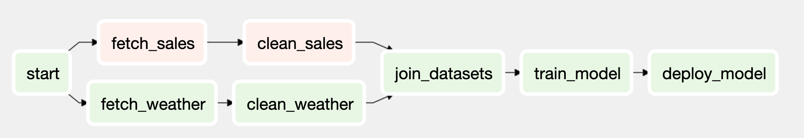
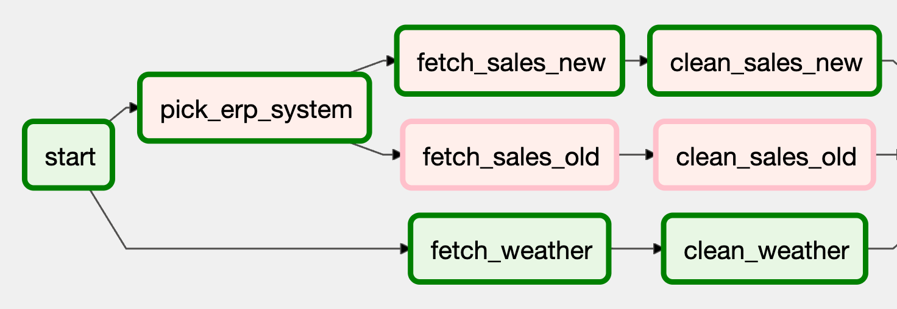

# 실행 방법
---
* ```docker-compose up -d --build```
* ID: admin / PW: admin

# Study
---
## branch_task
날짜를 기준으로 실행해야하는 로직이 다를 경우 수집 태스크 코드를 변경하여 브랜치할 수 있음.  
-> 태스크 내에서 브랜치

예시)
```python
def _clean_sales(**context):
    if context["execution_date"] < ERP_CHANGE_DATE:
        _clean_sales_old(**context)
    else:
        _clean_sales_new(**context)
...
clean_sales_data = PythonOperator(task_id = "clean_sales", python_callable = _clean_sales)
```



#### 장점
1. DAG 자체의 구조를 수정하지 않고도 DAG에서 약간의 유연성을 허용할 수 있음.

#### 단점
1. 코드로 분기가 가능한 유사한 태스크로 구성된 경우에만 작동.
2. 만약 완전히 다른 태스크 체인이 필요할 경우, 두 개의 개별 태스크 세트로 분할하는 것이 나을 수 있음.
3. DAG이 실행중에 어떤 코드 분기를 사용하고 있는지 확인이 어려움.
   1. old 를 사용하는지 New를 사용하는지 확인하기 위해서는 코드 또는 로그를 확인 해야함.

## branch_dag
두 개의 개별 태스크 세트(new, old)를 개발하고 DAG이 이전 또는 새로운 ERP 시스템에서 데이터 수집 작업 실행을 선택할 수 있도록 함.  

#### BranchPythonOperator
* PythonOperator와 같이 python_callable 인자를 사용
* python_callable로 전달된 인자는 작업 결과로 *downstream task_id* 를 리턴 (task_id 리스트 반환도 가능)
* 리턴된 ID는 브랜치 태스크 완료 후 *실행할 downstream task를 결정.*

#### 주의점
```python
[clean_sales_old, clean_sales_new] >> join_datasets
```
위와 같이 태스크 의존성을 정의하면 문제가 발생한다.  
원인은 기본적으로 Airflow 태스크 자체를 실행하기 전에 지정된 upstream task가 모두 성공적으로 완료되어야 하기 때문이다.



위 사진을 보면 pick_erp_system 으로 인해 clean_sales_old 가 skipped 상태가 된다.  
이 때 join_datasets는 clean_sales_old가 success 상태가 아니기 때문에 skipped 되는 상황이 발생하게 된다.

따라서, join_datasets에 트리거 룰을 아래와 같이 작성해야 한다.
```python
join_datasets = PythonOperator(
    ...,
    trigger_rule = "none_failed",
)
```

#### 단점
1. join_datasets 태스크에 연결되는 태스크가 3개.
   1. 기존 의도는 판매 / 날씨 데이터를 가져온 다음 두 데이터를 조인하는것
   2. 지금 플로우는 ERP -> 판매 / 날씨 데이터 를 가져온 다음 조인.

## branch_dag_join


# 참고
---
1. [Data Pipelines with Apache Airflow (Chapter 5)](https://github.com/K9Ns/data-pipelines-with-apache-airflow/tree/main/chapter05) 