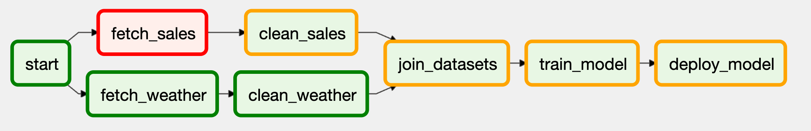

# 실행 방법
* ```docker-compose up -d --build```
* ID: admin / PW: admin


# Study

> Trigger Rule을 이해하기 위해서는 먼저 Airflow가 DAG 실행 내에서 작업을 실행하는 방법을 알아야 한다.

* 근본적으로 Airflow는 DAG를 실행할 때 각 task를 지속적으로 확인하여 실행 여부를 확인한다.
* 태스크 실행아 가능하다고 판단되면 그 즉시 스케줄러에 의해 선택된 후, 실행을 예약한다.
* 결론적으로 Airflow에 사용 가능한 

## Trigger Rules
---
그렇다면 Airflow는 태스크 실행 시기를 어떻게 결정할까?  
그것을 위해 필요한 것이 **트리거 규칙** 이다.

### 트리거 규칙(trigger rule)이란?
1. 트리거 규칙은 태스크의 의존성 기능(= DAG 안에서 선행 태스크 조건)과 같이 Airflow가 태스크가 실행 준비가 되어 있는지 여부를 결정하기 위한 필수적인 조건이다.
2. Airflow의 기본 트리거 규칙은 all_success 이며, 태스크를 실행하려면 모든 의존적인 태스크가 모두 성공적으로 완료되어야 함을 의미한다.


위 DAG은 기본적인 트리거 규칙을 사용하는 DAG이다.  
이 DAG이 실행을 시작하면 Airflow는 실행할 수 있는 작업(**즉, 성공적으로 완료되지 않은 의존성 없는 태스크**) 을 계속 시작하려 할 것이다.

이 경우, 의존성이 없는 ```start``` 태스크만 이 조건을 만족하기에, Airflow는 먼저 ```start`` 태스크를 실행하여 DAG 실행을 시작한다. 이후는 의존성에 따라 전체 DAG이 실행될 때 까지 나머지 태스크가 실행된다.

### 만약 실행 중에 태스크 중 하나가 오류를 발생시킨다면?



위 사진은 fetch_sales 태스크를 일부러 실패한 DAG 그래프 뷰이다.

fetch_sales 가 실패하게 되면 다운스트림 태스크인 clean_sales 를 더 이상 진행할 수 없게 된다.  
clean_sales 태스크에 ```upstream_failed``` 상태가 할당되며, 이는 업스트림 태스크 실패로 더 이상 진행할 수 없음을 나타낸다.

> 업스트림 태스크 결과가 다운스트림 태스크에도 영향을 미치는 동작 유형을 **propagation(전파)** 라고 하는데, 이 경우 업스트림 실패가 다운스트림 태스크로 전파되기 때문이다.  
> 건너뛴 태스크의 효과로 default trigger rule에 의해 다운스트림 모든 태스크도 건너뛰게 된.

### Other Trigger Rules
|트리거 규칙|동작|사용 사례|
|:---|:---|:---|
|all_success(default)|모든 업스트림 태스크가 성공적으로 완료되면 트리거된다.|일반적인 워크플로에 대한 기본 트리거 규칙이다.|
|all_failed|모든 업스트림 태스크가 실패했거나, 업스트림 태스크의 오류로 인해 실패했을 경우 트리거된다.|태스크 그룹에서 하나 이상 실패가 예상되는 상황에서 오류 처리 코드를 트리거한다.|
|all_done|결과 상태에 관계없이 모든 부모가 실행을 완료하면 트리거된다.|모든 태스크가 완료되었을 때 실행할 청소 코드를 실행한다.(예: 시스템 종료 또는 클러스터 중지)|
|one_failed|하나 이상의 업스트림 태스크가 실패하자마자 트리거되며, 다른 업스트림 태스크의 실행 완료를 기다리지 않는다.|알림 또는 롤백과 같은 일부 오류 처리 코드를 빠르게 트리거한다.|
|none_failed|실패한 업스트림 태스크가 없고, 성공 또는 skipped 된 경우 트리거된다.|Airflow DAG 상에서 조건부 브랜치의 결합에 사용|
|none_skipped|skipped 된 업스트림 태스크가 없고, 성공 또는 실패한 경우 트리거된다.|모든 업스트림 태스크가 실행된 경우, 해당 결과를 무시하고 트리거한다.|
|dummy|업스트림 태스크의 상태와 관계없이 트리거된다.|테스트 시 사용|


